# Proyecto: Análisis de datos con Amazon QuickSight y archivos de Netflix

Este proyecto guía paso a paso cómo cargar archivos CSV desde S3 y analizarlos visualmente con Amazon QuickSight. Aprenderás a crear un bucket, configurar permisos, subir un archivo manifest, conectarlo con QuickSight, visualizar dashboards, y al final, **eliminar tu cuenta de QuickSight para evitar cargos**.

---

## Paso Setup: Descargar archivos necesarios

Descarga el archivo `proyecto_quicksight.rar`, descomprímelo y obtendrás dos archivos:  
- `netflix_titles.csv`  
- `manifest.json`

---

## Paso 1: Iniciar sesión en AWS y buscar S3

Ingresa a tu cuenta de AWS y en la barra superior escribe “S3” para buscar el servicio.

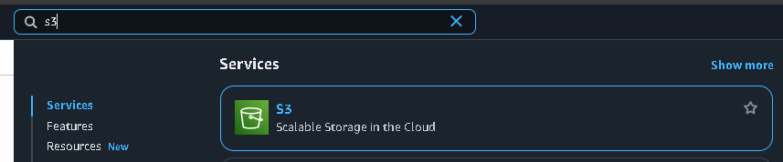

---

## Paso 2: Crear un bucket

Haz clic en **Create bucket** y nómbralo `quicksight-project-tuNombre`.

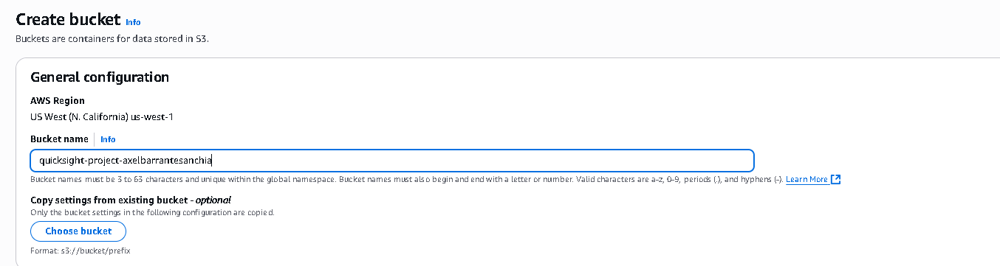

---

## Paso 3: Dejar configuraciones por defecto

Presiona **Create bucket** sin cambiar configuraciones por defecto.

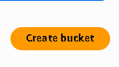

---

## Paso 4: Subir archivos descomprimidos

Dentro del bucket creado, haz clic en **Upload** y sube `netflix_titles.csv` y `manifest.json` (sin comprimir, por separado).

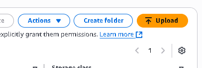

---

## Paso 5: Verificar carga exitosa

Asegúrate de que ambos archivos estén cargados correctamente.

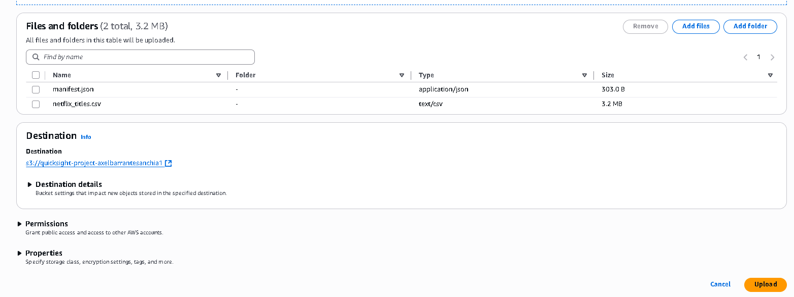

---

## Paso 6: Copiar URI de S3

Haz clic en `netflix_titles.csv` y copia su URI.

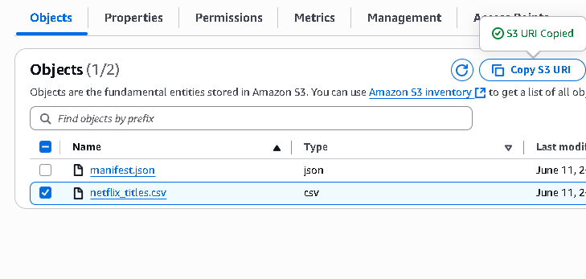

---

## Paso 7: Editar manifest.json

Abre `manifest.json` con VS Code o un editor de texto.  
Reemplaza el campo `"Uri"` en `fileLocations` por el URI del paso anterior.

> **Explicación**:
> - `format`: `"CSV"`
> - `delimiter`: `","`
> - `textQualifier`: `"\""` → se usa para indicar si los campos están entre comillas dobles.
> - `containsHeader`: `true`

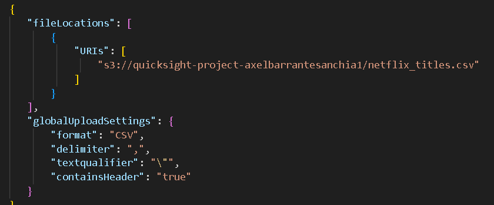

---

## Paso 8: Subir manifest.json editado

Haz clic en **Upload** y vuelve a subir `manifest.json`.

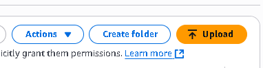

---

## Paso 9: Confirmar reemplazo

S3 reemplazará automáticamente el archivo anterior.

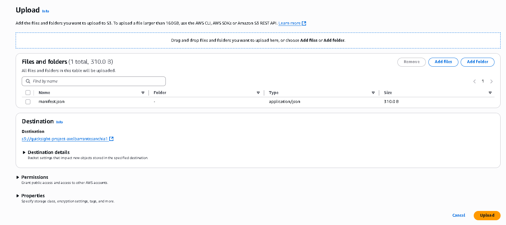

---

## Paso 10: Ver mensaje de éxito

Verifica el mensaje "Upload succeeded".

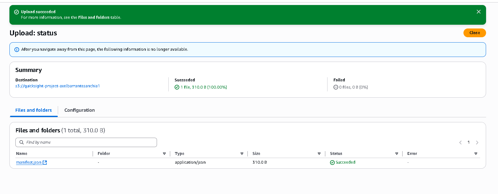

---

## Paso 11: Buscar QuickSight en la consola

En la barra de búsqueda escribe “Quicksight”.

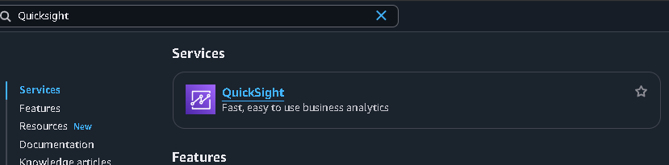

---

## Paso 12: Registrarse en QuickSight

Haz clic en **Sign up for QuickSight** (es gratis por 30 días).

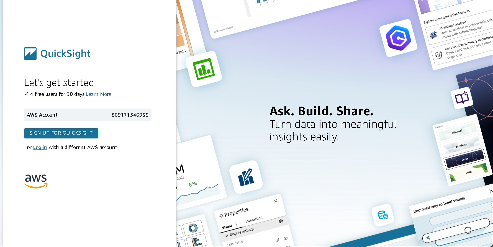

---

## Paso 13: Llenar Contact Information

Usa tu correo de AWS. Método de autenticación: déjalo por defecto.
<!-- -------------------------------------------------- -->
Escoge la misma región que estás utilizando en tu consola de AWS.

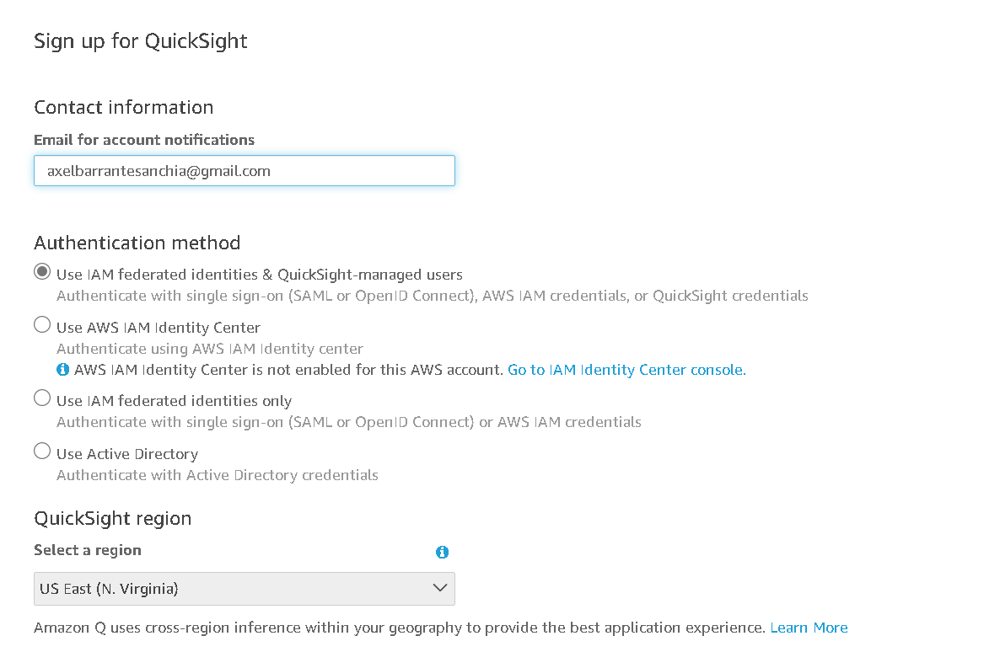

---

## Paso 14: Nombre y permisos

En `QuickSight account name`, coloca tu nombre + “-Quicksight”.  
<!-- -------------------------------------------------- -->
Activa solo S3 y **selecciona el bucket creado**.

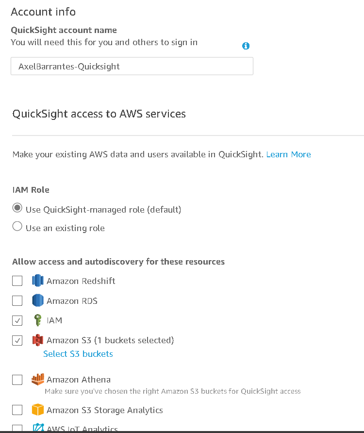

---

## Paso 15: Desmarcar Add-on

Quita la selección de **AddPixelPerfect Reports** para evitar cargos.

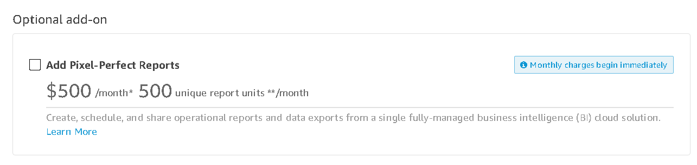

---

## Paso 16: Finalizar configuración

Presiona **Finish**.

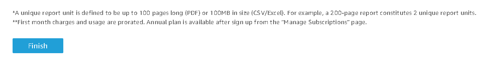

---

## Paso 17: Esperar creación de cuenta

Aparecerá "Creating your account...".

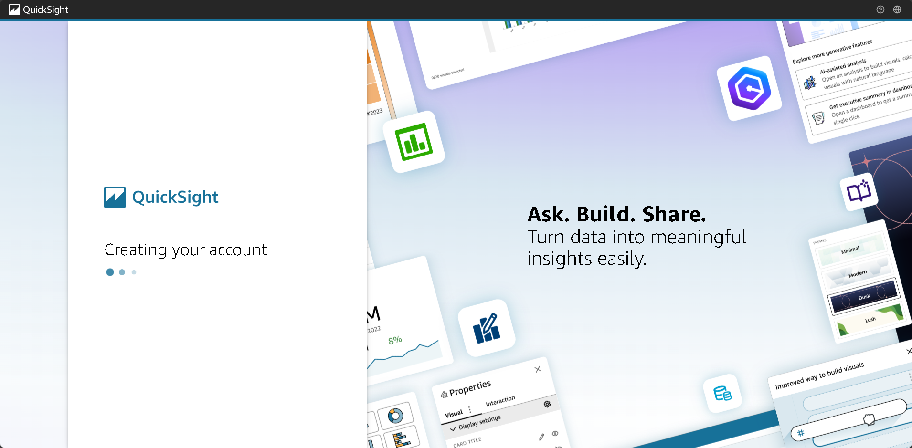

---

## Paso 18: Ir a QuickSight

Una vez creada la cuenta, haz clic en **Go to QuickSight**.

---

## Paso 19: Ir a Datasets

En el menú lateral, selecciona **Datasets**.

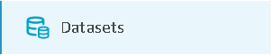

---

## Paso 21: Crear nuevo Dataset

Haz clic en **Create new dataset**.
<!-- -------------------------------------------------- -->
Escoge S3 entre las fuentes disponibles.
<!-- -------------------------------------------------- -->
Data source name: `Kaggle-netflix-data`.
<!-- -------------------------------------------------- -->
Copia y pega el URI de `manifest.json`.
<!-- -------------------------------------------------- -->

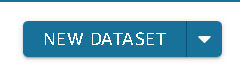
<!-- -------------------------------------------------- -->
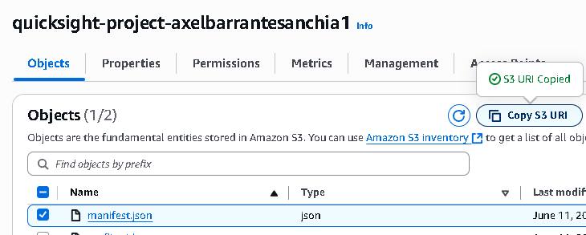
<!-- -------------------------------------------------- -->
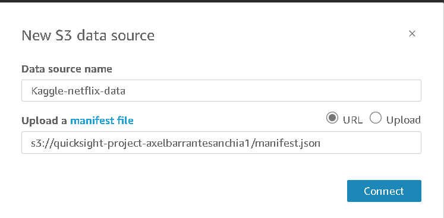
<!-- -------------------------------------------------- -->

---

## Paso 22: Conectar

Haz clic en **Connect**.

---

## Paso 23: Visualizar

Haz clic en **Visualize**.

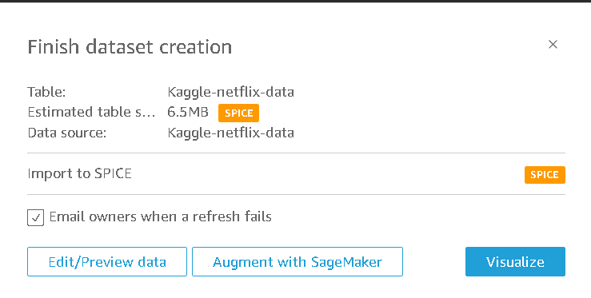

---

## Paso 24: Crear análisis

Aparecerá una nueva ventana, toca **Create**.

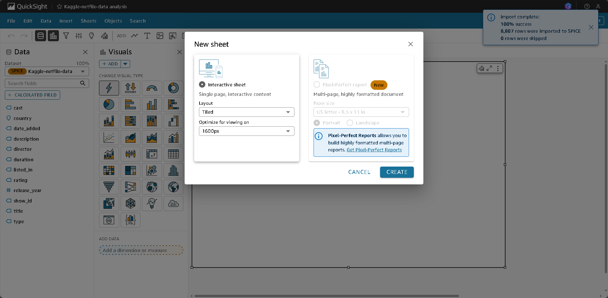

---

## Paso 25: Explorar columnas

En la izquierda verás los campos del CSV como `cast`, `country`, `date_added`, etc.

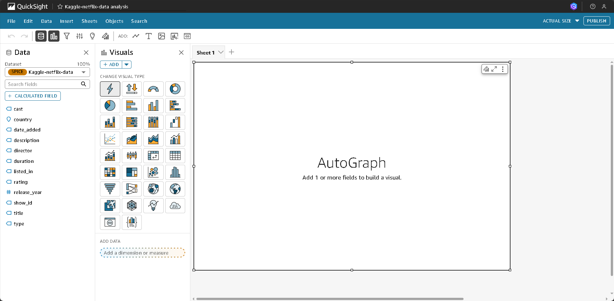

---

## Paso 26: Agregar visualización

Haz clic en **Add** en la sección Visuals.

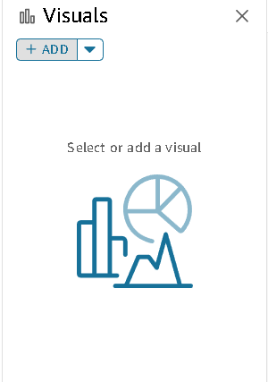

---

## Paso 27: Añadir campo `release_year`

Arrástralo al área de visualización.

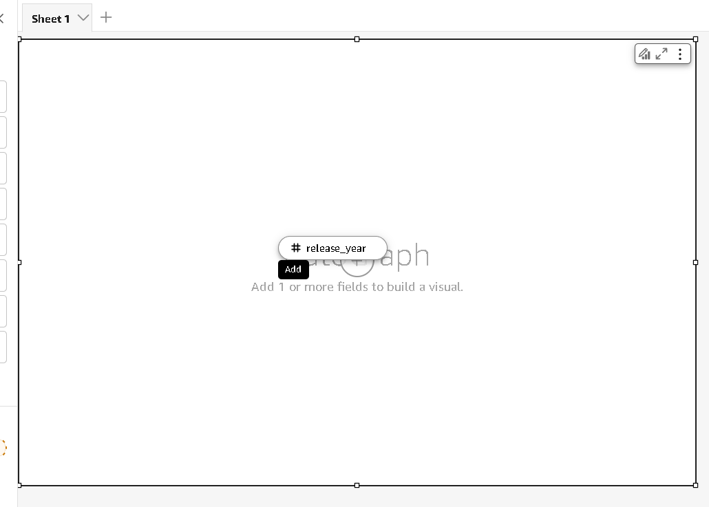

---

## Paso 28: Resultado

Verás una gráfica por año.

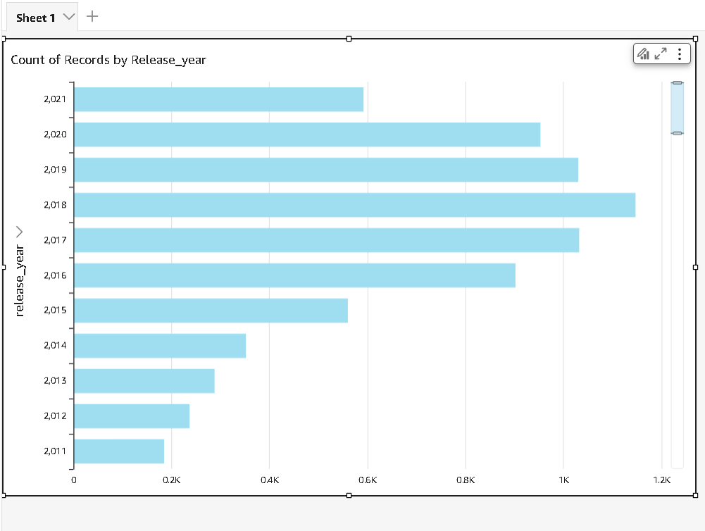

---

## Paso 29: Añadir campo type

Arrástralo a la sección de **Group/Color**.

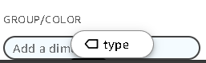

---

## Paso 30: Explicación de QuickSight

Ahora puedes ver por tipo (`Movie` o `TV Show`) y por año. 
<!-- -------------------------------------------------- -->
QuickSight es una herramienta de BI (Business Intelligence) de AWS que permite transformar datos crudos en dashboards interactivos para tomar decisiones basadas en datos.
<!-- -------------------------------------------------- -->
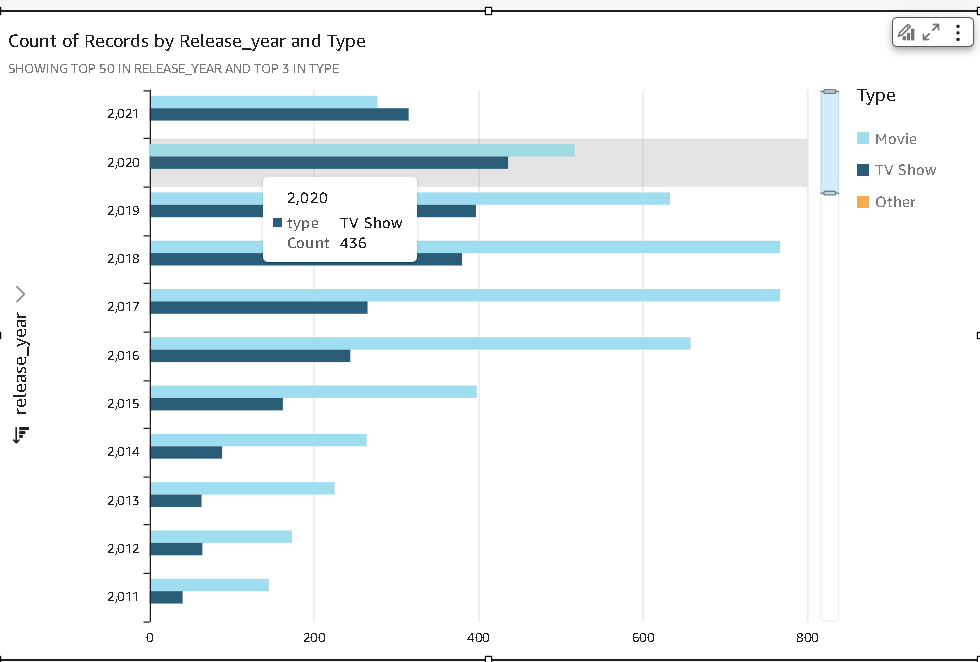

---

## Paso 31: Visualizaciones de ejemplo

Múltiples cuadros permiten analizar duración, directores, ratings, y top por país.

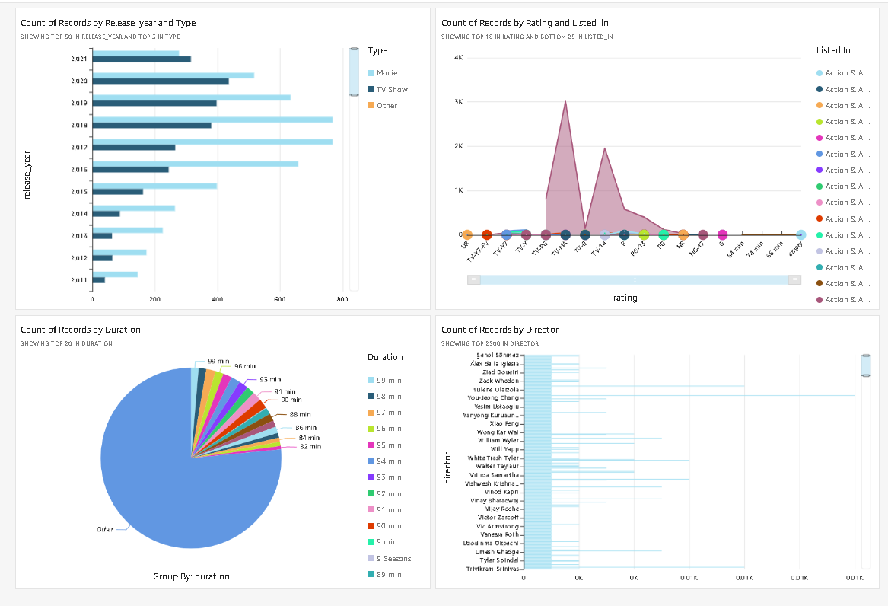

---

## Paso 32: Agregar nueva visualización en forma de tabla

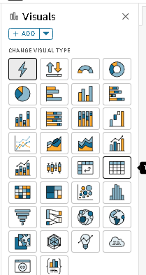

---

## Paso 33: Usar campo `country` como valor

Verás muchos valores vacíos.

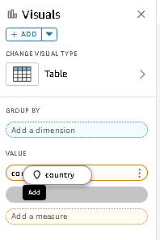

---

## Paso 34: Notar datos incompletos

Para un mejor análisis se necesita información más completa.  
<!-- -------------------------------------------------- -->
El archivo original `netflix_titles.csv` **no contiene todos los campos con datos completos**, y por eso el campo `country` aparece con muchos valores vacíos.  
<!-- -------------------------------------------------- -->
Es necesario **añadir un archivo actualizado** que incluya esta información para mejorar la calidad del análisis.

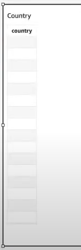

---

## Paso 35: Subir archivo actualizado

Sube `netflix_titles_updated.json` al bucket.

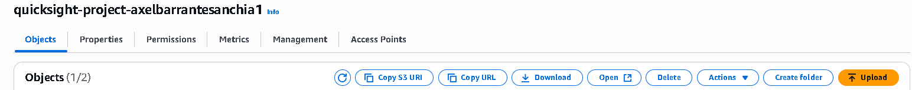

---

## Paso 36: Verificar subida

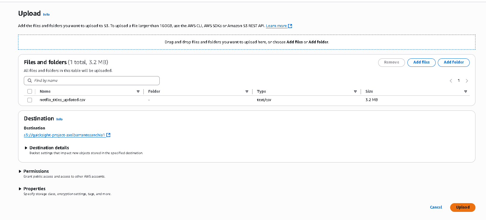

---

## Paso 37: Confirmar subida exitosa

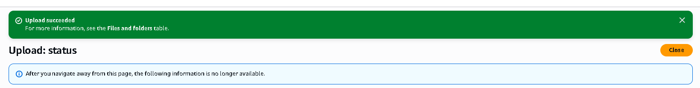

---

## Paso 38: Editar manifest.json

Cambia el URI al del nuevo archivo.

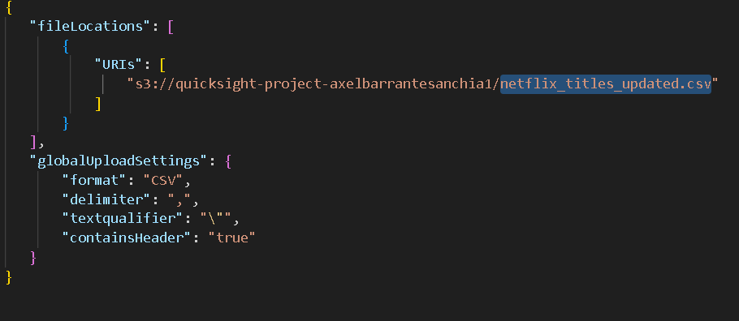

---

## Paso 39: Refrescar navegador

Vuelve a la pestaña donde está QuickSight.

---

## Paso 40: QuickSight muestra aviso "Import complete"

Verás una notificación de **"Import complete"** en QuickSight, indicando que los nuevos datos del bucket S3 fueron cargados exitosamente.  
<!-- -------------------------------------------------- -->
**Sin embargo**, esto **no actualiza automáticamente** los datos que ya están siendo utilizados en los dashboards. Aún se requiere una acción manual para reflejar los cambios en los análisis.

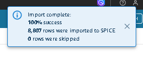

---

## Paso 41: Ir a Datasets

Ve a Data > Datasets.

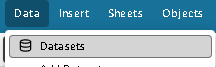

---

## Paso 42: Editar dataset

Toca los tres puntos > Edit.

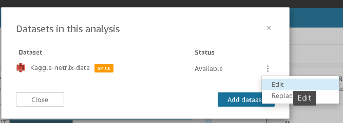

---

## Paso 43: Ver nuevos datos reflejados

Ahora el campo `country` tiene mejor información.  
<!-- -------------------------------------------------- -->
Dentro del modo de edición del dataset, **sí se reflejan los cambios** aplicados al nuevo archivo, aunque **aún no se vean en los dashboards ya existentes**. 
<!-- -------------------------------------------------- -->
Esto es una buena señal de que la actualización fue exitosa; solo hay que continuar con el proceso para que los dashboards también se actualicen.

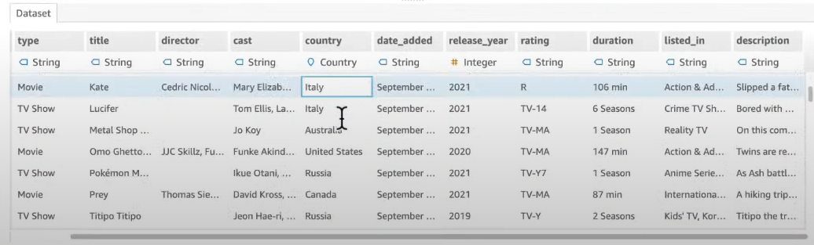

---

## Paso 44: Refrescar

Haz clic en **Refresh** abajo a la izquierda.  
<!-- -------------------------------------------------- -->
Esto forzará la actualización de los datos utilizados en los dashboards, haciendo que reflejen la información más reciente cargada desde el bucket S3.

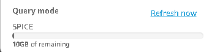

---

## Paso 45: Marcar Full Refresh

Presiona **Refresh** otra vez.

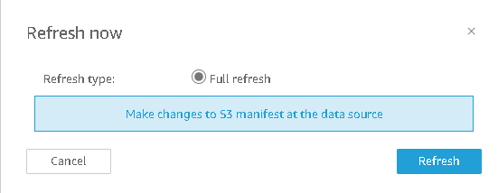

---

## Paso 46: Aceptar advertencia

Esto reemplaza los datos antiguos con los nuevos.

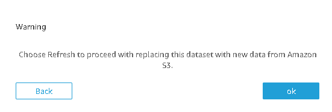

---

## Datos actualizados!

Listo, puedes ver los cambios.  
<!-- -------------------------------------------------- -->
Regresa a los dashboards en QuickSight y comprueba por ti mismo que ahora muestran la información actualizada desde el nuevo archivo cargado en S3.

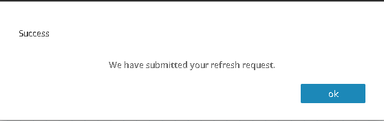

---
## IMPORTANTE: Eliminar QuickSight para evitar costos

Lo que sigue es **opcional**, pero **ALTAMENTE RECOMENDADO** si ya no vas a usar QuickSight.  
<!-- -------------------------------------------------- -->
> ⚠️ **IMPORTANTE:** QuickSight puede generar costos aunque no lo estés utilizando activamente.
> <!-- -------------------------------------------------- -->
> Para evitar cargos inesperados, asegúrate de eliminar tu cuenta si terminaste el proyecto.
> <!-- -------------------------------------------------- -->
> > Para evitar cargos innecesarios, asegúrate de **eliminar tu cuenta de QuickSight** y también **borrar el bucket de S3** donde subiste los datos.

---

## Paso 48: Eliminar cuenta de QuickSight

Haz clic en el ícono de perfil.

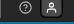

---

## Paso 49: Ir a Manage QuickSight

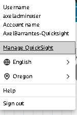

---

## Paso 50: Ir a Account Settings

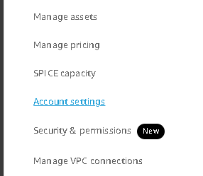

---

## Paso 51: Desactivar protección y eliminar

En "Account termination", escribe `confirm` y elimina la cuenta.

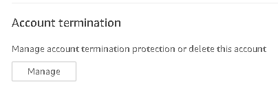

---

## Paso 52: Confirmación de eliminación

Verás el mensaje "Unsubscribe Successful".

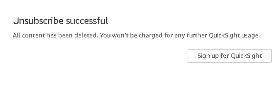

---

## Paso 53: Eliminar bucket S3

Ve a S3 y elimina el bucket para cerrar el proyecto.

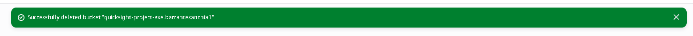

---

## Paso 54: ¡Proyecto terminado!

¡Gracias por completar este proyecto con QuickSight!

✨ Autor
<!-- -------------------------------------------------- -->
**Axel Andres Barrantes Anchia**
<!-- -------------------------------------------------- -->
📍 Santa Ana, San José
<!-- -------------------------------------------------- -->
📧 [axelbarrantesanchia@gmail.com](mailto:axelbarrantesanchia@gmail.com)
